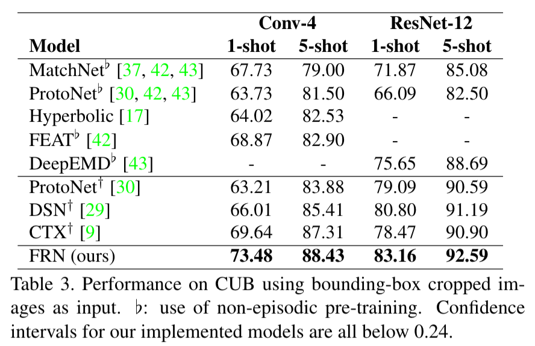
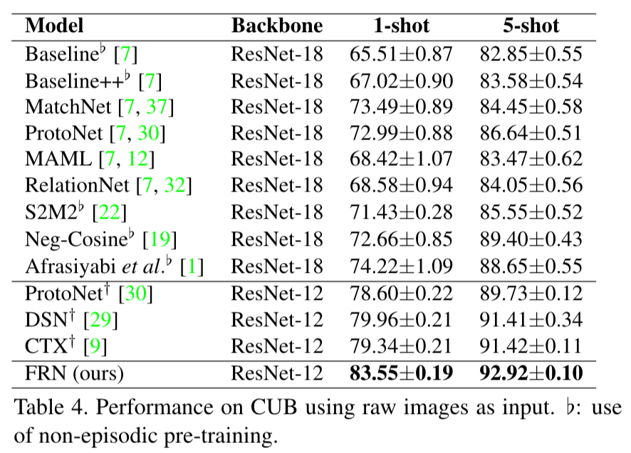
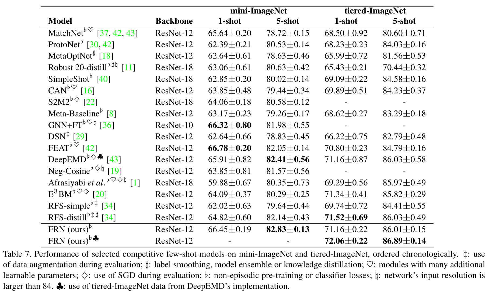
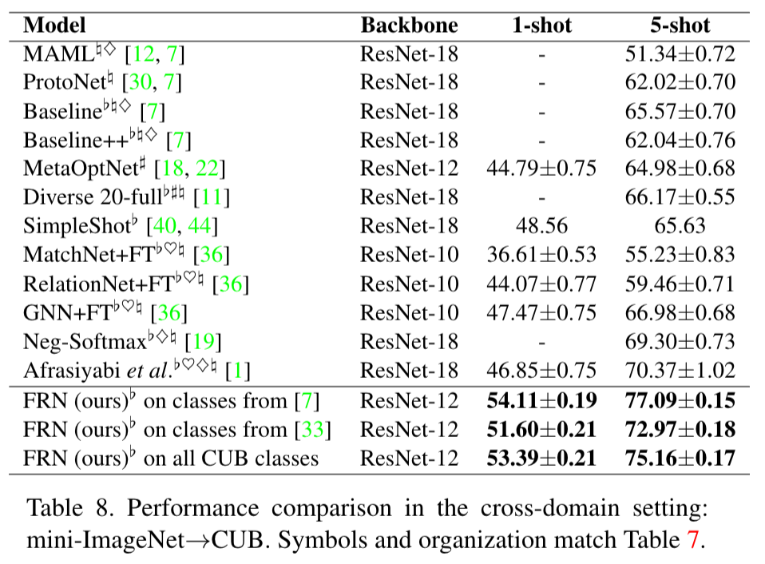

# Few-Shot Classification with Feature Map Reconstruction Networks

This repository contains the reference Pytorch source code for the following paper:

[Few-Shot Classification with Feature Map Reconstruction Networks](https://arxiv.org/abs/2012.01506)

[Davis Wertheimer](https://daviswer.github.io/)\*, [Luming Tang](http://lumingtang.info/)\*, [Bharath Hariharan](http://home.bharathh.info/) (\* denotes equal contribution)

CVPR 2021 ([video](https://www.youtube.com/watch?v=kbsRsbQKTRc))

If you find our code or paper useful to your research work, please consider citing our work using the following bibtex:
```
@InProceedings{Wertheimer_2021_CVPR,
    author    = {Wertheimer, Davis and Tang, Luming and Hariharan, Bharath},
    title     = {Few-Shot Classification With Feature Map Reconstruction Networks},
    booktitle = {Proceedings of the IEEE/CVF Conference on Computer Vision and Pattern Recognition (CVPR)},
    month     = {June},
    year      = {2021},
    pages     = {8012-8021}
}
```

## Code environment
This code requires Pytorch 1.7.0 and torchvision 0.8.0 or higher with cuda support. It has been tested on Ubuntu 16.04. 

You can create a conda environment with the correct dependencies using the following command lines:
```
conda env create -f environment.yml
conda activate FRN
```

## Setting up data
You must first specify the value of `data_path` in `config.yml`. This should be the absolute path of the folder where you plan to store all the data.

The following datasets are used in our paper: 
- CUB_200_2011 \[[Dataset Page](http://www.vision.caltech.edu/visipedia/CUB-200-2011.html), [Download Link](https://drive.google.com/file/d/1hbzc_P1FuxMkcabkgn9ZKinBwW683j45/view)\]
- FGVC-Aircraft \[[Dataset Page](http://www.robots.ox.ac.uk/~vgg/data/fgvc-aircraft/), [Download Link](https://www.robots.ox.ac.uk/~vgg/data/fgvc-aircraft/archives/fgvc-aircraft-2013b.tar.gz)\]
- iNaturalist2017 \[[Dataset Page](https://github.com/visipedia/inat_comp/tree/master/2017), [Download Data](https://ml-inat-competition-datasets.s3.amazonaws.com/2017/train_val_images.tar.gz), [Download Annotations](https://ml-inat-competition-datasets.s3.amazonaws.com/2017/train_2017_bboxes.zip)\]
- mini-ImageNet \[[Dataset Page](https://github.com/twitter/meta-learning-lstm), [Download Link](https://drive.google.com/file/d/0B3Irx3uQNoBMQ1FlNXJsZUdYWEE/view)\] 
- tiered-ImageNet \[[Dataset Page](https://github.com/renmengye/few-shot-ssl-public), [Download Link](https://drive.google.com/file/d/1g1aIDy2Ar_MViF2gDXFYDBTR-HYecV07/view)\]
- tiered-ImageNet_DeepEMD (derived from [DeepEMD](https://arxiv.org/abs/2003.06777)'s [implementation](https://github.com/icoz69/DeepEMD)) \[[Dataset Page](https://github.com/icoz69/DeepEMD), [Download Link](https://drive.google.com/file/d/1ANczVwnI1BDHIF65TgulaGALFnXBvRfs/view)\]

There are two options to prepare data for few-shot classification:

- **DIRECT DOWNLOAD:** Access the pre-processed few-shot datasets used in our experiments directly. You can do this automatically or manually:
    - Use the provided shell script to download and extract all datasets.<!-- If you only want to download the datasets you are interested in, please feel free to comment out the code sections for the other datasets -->
        ```
        cd data
        ./download_fewshot.sh
        ```
    - Download individual tar files from this Google Drive [Link](https://drive.google.com/drive/folders/1gHt-Ynku6Yc3mz6aKVTppIfNmzML1sNG?usp=sharing) and extract few-shot datasets into your chosen `data_path` folder one by one.

- **MANUAL CONFIGURATION:** Download original datasets, then pre-process them into individual few-shot versions one by one. Allows for greater control over pre-processing and provides access to the original source data. 
    1. **Download the original datasets.** Again, this can be done automatically or manually:
        - Use the provided shell script to download and extract all datasets.
            ```
            cd data
            ./download_origin.sh
            ```
        - Download individual datasets using the download links provided above, and then extract them into your chosen `data_path` folder. Note that meta-iNat / tiered meta-iNat and tiered-ImageNet_DeepEMD require some extra processing steps:<!-- For how to extract tgz/tar/zip files using command lines, please refer to the code in `data/download_origin.sh`. -->
            ```
            cd data_path

            # For meta-iNat / tiered meta-iNat:
            mkdir inat2017
            mv train_val_images inat2017/train_val_images
            mv train_2017_bboxes.json inat2017/train_2017_bboxes.json

            # For tiered-ImageNet_DeepEMD:
            mv tiered_imagenet tiered-ImageNet_DeepEMD
            ```
         
    2. **Pre-process each dataset** one-by-one into corresponding few-shot versions. 
        ```
        cd data
        python init_CUB_fewshot.py
        python init_Aircraft_fewshot.py
        python init_meta_iNat.py
        python init_mini-ImageNet.py
        python init_tiered-ImageNet.py
        python init_tiered-ImageNet_DeepEMD.py
        ```
    

After setting up few-shot datasets following the steps above, the following folders will exist in your `data_path`:
- `CUB_fewshot_cropped`: 100/50/50 classes for train/validation/test, using bounding-box cropped images as input
- `CUB_fewshot_raw`: class split same as above, using raw un-cropped images as input
- `Aircraft_fewshot`: 50/25/25 classes for train/validation/test
- `meta_iNat`: 908/227 classes for train/test. <!-- Holds softlinks to images in `inat2017_84x84` -->
- `tiered_meta_iNat`: 781/354 classes for train/test, split by superclass. <!-- Holds softlinks to images in `inat2017_84x84`  -->
- `mini-ImageNet`: 64/16/20 classes for train/validation/test
- `tiered-ImageNet`: 351/91/160 classes for train/validation/test, images are 84x84
- `tiered-ImageNet_DeepEMD`: derived from DeepEMD's implementation, images are 224x224

Under each folder, images are organized into `train`, `val`, and `test` folders. In addition, you may also find folders named `val_pre` and `test_pre`, which contain validation and testing images pre-resized to 84x84 for the sake of speed.

You can use the jupyter notebook `data/visualize.ipynb` to explore and randomly visualize the images inside these few-shot datasets.

## Train and test
For fine-grained few-shot classification, we provide the training and inference code for both FRN and our Prototypical Network (Proto) baseline, as they appear in the paper. 

To train a model from scratch, simply navigate to the appropriate dataset/model subfolder in `experiments/`. Each folder contains 3 files: `train.py`, `train.sh` and `test.py`. Running the shell script `train.sh` will train and evaluate the model with hyperparameters matching our paper. Explanations for these hyperparameters can be found in `trainers/trainer.py`.

For example, to train Proto on `CUB_fewshot_cropped` with Conv-4 as the network backbone under the 1-shot setting, run the following command lines:
```
cd experiments/CUB_fewshot_cropped/Proto/Conv-4_1-shot
./train.sh
```

For general few-shot classification on ImageNet variants, we provide code for FRN pre-training and subsequent episodic fine-tuning in the corresponding subfolders in `experiments`.

For example, to train FRN on `mini-ImageNet`, run the following command lines:
```
# first run pre-training
cd experiments/mini-ImageNet/FRN/ResNet-12_pretrain
./train.sh

# then run episodic fine-tuning
cd experiments/mini-ImageNet/FRN/ResNet-12_finetune
./train.sh
```

Pre-training is usually very slow, so we also provide pre-trained FRN model weights for each general few-shot dataset at this Google Drive [Link](https://drive.google.com/file/d/1n6zg5Bkj5FzSHpRbJdzlUkSVDtmjgobm/view?usp=sharing). You can download the network weights and run the fine-tuning script directly, without pre-training from scratch. Directions for this are in the [following section](#Trained-model-weights).

All training scripts log training and validation accuracies in both the std output and a generated `*.log` file. These logs can be visualized via tensorboard. The tensorboard summary is located in the `log_*` folder. The model snapshot with the current best validation performance is saved as `model_*.pth`. 

After training concludes, test accuracy and 95% confidence interval are logged in the std output and `*.log` file. To re-evaluate a trained model, run `test.py`, setting the internal `model_path` variable to the saved model `*.pth` you want to evaluate.


## Trained model weights
We provide trained model weights for all FRN and Proto models with a ResNet-12 network backbone. You can download these either manually or automatically:
- Download the tar file from this Google Drive [Link](https://drive.google.com/file/d/1n6zg5Bkj5FzSHpRbJdzlUkSVDtmjgobm/view?usp=sharing) and extract it into the `trained_model_weights/` folder.
- Use the provided shell script to download and extract the models automatically:
    ```
    cd trained_model_weights/
    ./download_weights.sh
    ```
The directory structure for `trained_model_weights/` mirrors `experiments/`. For example, the trained `model.pth` for 5-shot ResNet-12 Proto on raw image CUB is located at the following path:
```
trained_model_weights/CUB_fewshot_raw/Proto/ResNet-12_5-shot/model.pth
```

For ImageNet variants, we provide both pre-trained and final (fine-tuned) weights. For example, the two sets of FRN weights `model.pth` for tiered-ImageNet_DeepEMD are located at the following paths:
```
# pre-trained model weights
trained_model_weights/tiered-ImageNet_DeepEMD/FRN/ResNet-12_pretrain/model.pth

# final (fine-tuned) model weights 
trained_model_weights/tiered-ImageNet_DeepEMD/FRN/ResNet-12_finetune/model.pth
```

You can evaluate these trained models by changing the value of `model_path` in the corresponding `test.py` files. For example, to evaluate our final FRN model on mini-ImageNet, navigate to the following file:
```
experiments/mini-ImageNet/FRN/ResNet-12_finetune/test.py
```
then change the value of `model_path` by overwriting the following code line (line 16) in `test.py`:
```
model_path='../../../../trained_model_weights/mini-ImageNet/FRN/ResNet-12_finetune/model.pth'
```
then run `python test.py` in the command line, and you should be able to get the final evaluation results in the std output.

Every set of model weights contained in the folder `trained_model_weights/` has this option for `model_path` available as a comment within the corresponding `test.py` file, as in the example above.

### Finetune with pre-trained model weigths

You can also skip the long pre-training stage by episodically fine-tuning the downloaded and pre-trained FRN model weights directly. For example, to fine-tune pre-trained FRN model on mini-ImageNet, navigate to the following file:
```
experiments/mini-ImageNet/FRN/ResNet-12_finetune/train.py
```
change the value of `pretrained_model_path` by overwriting the following code line (line 33):
```
pretrained_model_path='../../../../trained_model_weights/mini-ImageNet/FRN/ResNet-12_pretrain/model.pth'
```
then run `./train.sh` in the command line, and the finetuning process will start.

Every set of pre-trained weights contained in the folder `trained_model_weights/` has this option for `pretrained_model_path` available as a comment within the corresponding `train.py` file, as in the example above.


## Selected few-shot classification results
Here we quote some performance comparisons from our paper on CUB, mini-ImageNet, tiered-ImageNet and mini-ImageNet &#8594; CUB.

<p align="center">

</p>
<p align="center">

</p>
<p align="center">

</p>
<p align="center">

</p>

## Contact
We have tried our best to verify the correctness of our released data, code and trained model weights. 
However, there are a large number of experiment settings, all of which have been extracted and reorganized from our original codebase. 
There may be some undetected bugs or errors in the current release. 
If you encounter any issues or have questions about using this code, please feel free to contact us via lt453@cornell.edu and dww78@cornell.edu.

